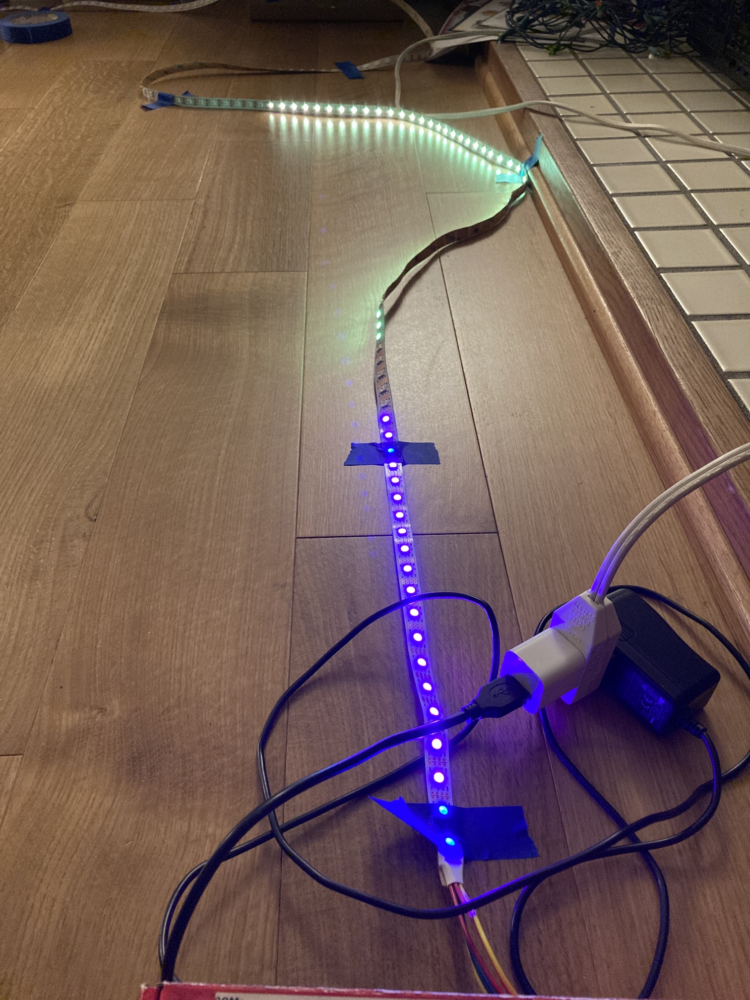

# Rainbow Chameleon
A 1-d arduino game that where the player needs to spin a dial to match the hue of an oncoming rainbow.
Prismatic doomscrolling...
Requires FastLED and runs best with an Arduino Mega. Send me a message if you would like to build such a thing and I can help provide schematics and setup information.

The repo contains a quick demo video to get a sense of what this looks like.
